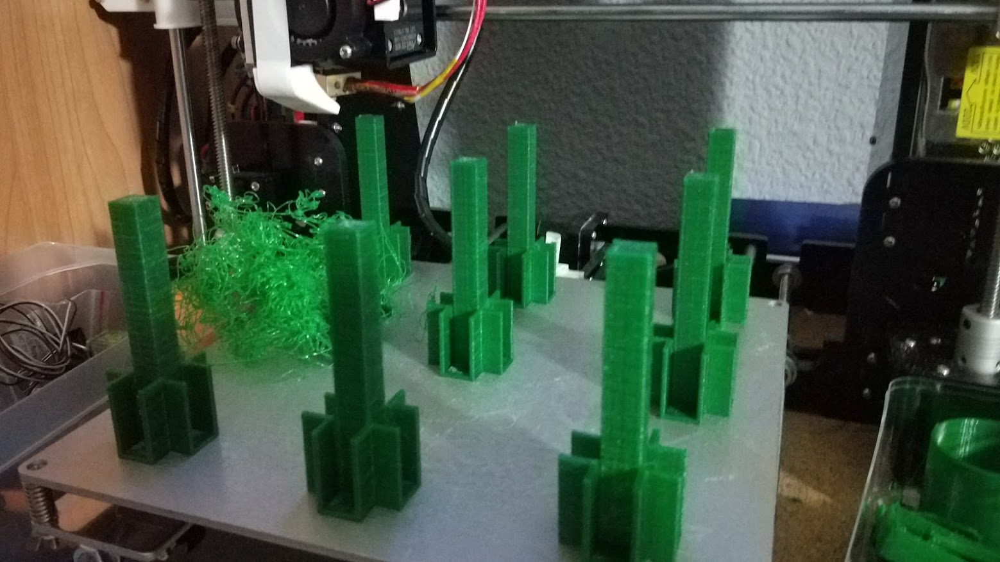

2017-11-03_Imprimir-replicas-de-una-en-una.md

Cuando imprimais con la cama llena podeis usar una opcion (abajo del todo en la configuracion de cura) que permite imprimir las piezas de una en una, en lugar de todas a la vez, asi si hay un problema esa pieza estara mal, pero el resto no.

Se llama Print Secuence y ese modo es "One at a time"
La alternativa, y funcionamiento normal es "all at once"

Ejemplo de como te salva 10 horas de impresion. Si se hubiera impreso todas a la vez seguro que los que estan al lado se habrian estropeado.

Hay que guardar un poco de espacio entre las piezas para que el extrusor pueda moverse. Si no hay ese espacio no se genera el laminado
