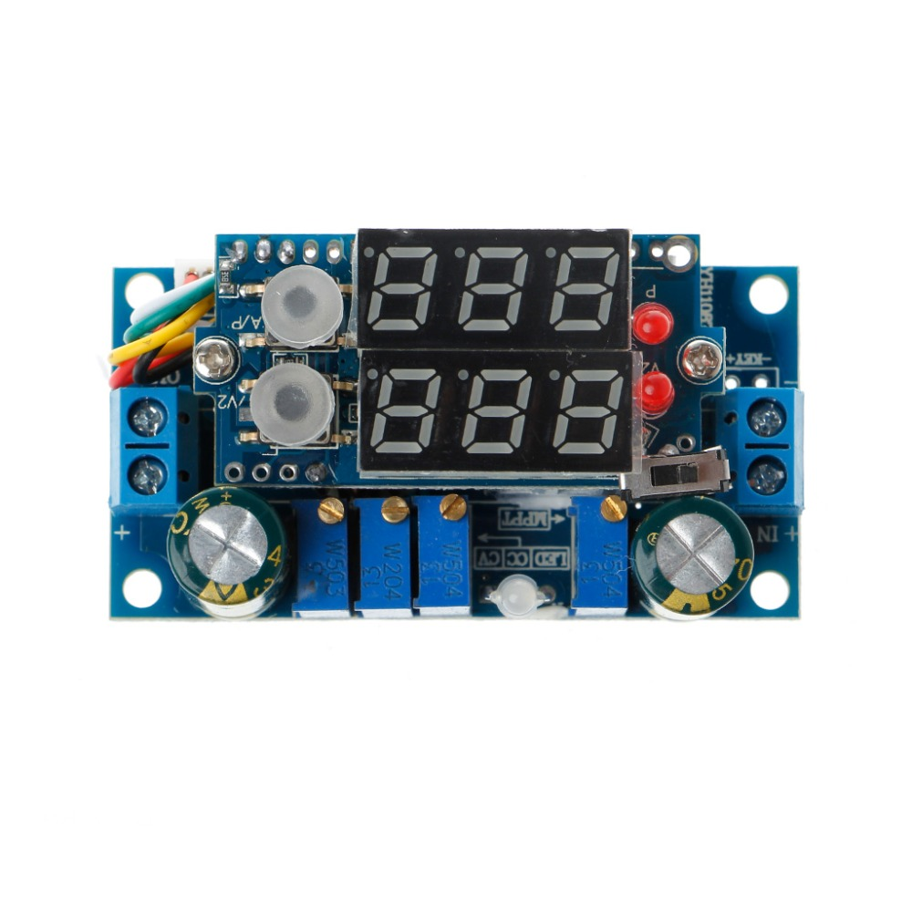
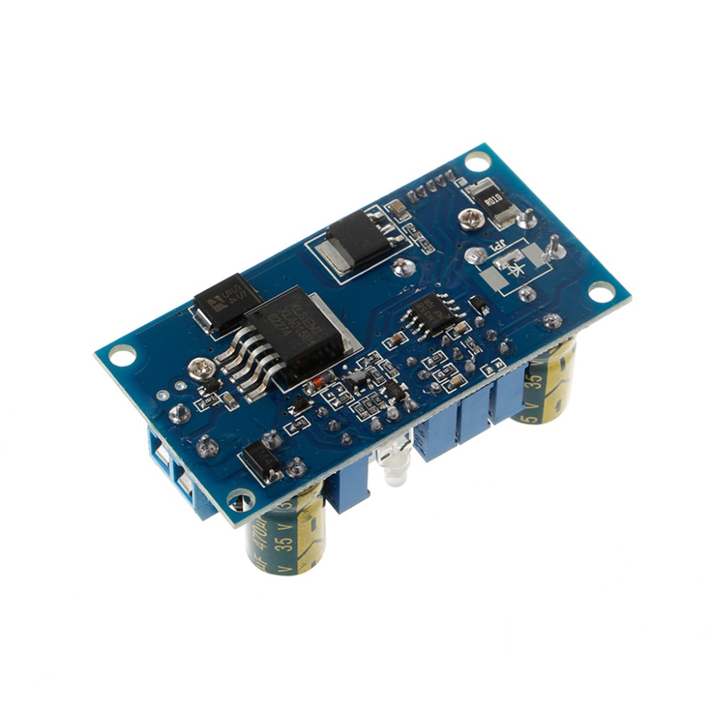
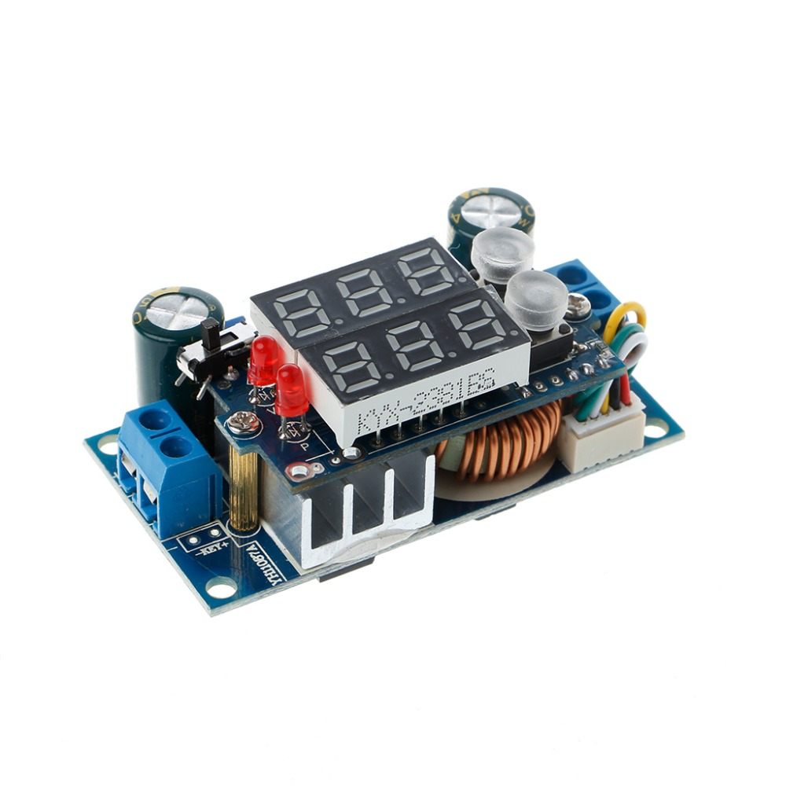
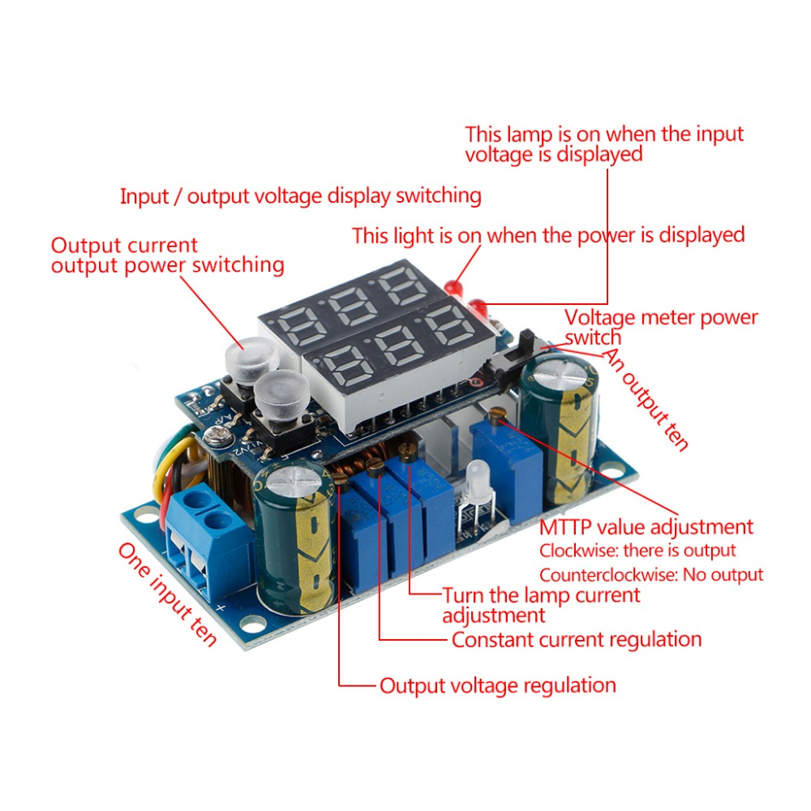

2018-05-14_Solar-MPTT.md

[5A MPPT Solar Panel Controller DC-DC Step-down CC/CV Charging Module Display LED Solar Controllers](https://es.aliexpress.com/item/5A-MPPT-Solar-Panel-Controller-DC-DC-Step-down-CC-CV-Charging-Module-Display-LED-Solar/32820613172.html)

Features:

* Module Properties: Non-isolated buck module (BUCK)
* Input voltage: 6~36 V
* Output voltage:1.25~32 V continuously adjustable (the default output 5V)
* MPPT voltage setting range: 6~36 V
* Output current range: 0.05~5A (The default output current is 3A)
* Turn lights output range: 0.01~5A (default turn lamp current 0.3A)
* the current range will be a little difference because the parts parameter error.
* Operating temperature: -40~ + 85 degree
* Operating frequency: 180 KHz
* Conversion efficiency: up to 95% (efficiency, input & output voltage, current and pressure-related)
* Short circuit protection: Yes
* Over temperature protection: Yes (automatically shut off the output after overtemperature)
* Input reverse polarity protection: None, (if necessary, please add the string into the diode)
* Output anti-anti-irrigation protection: None, the output must be connected to the battery plus blocking diode, otherwise it will burn the module.
* Installation: 4 Pcs 3mm screws(Not Included)
* Connection: IN is the input, OUT is output
* Multifunction double display: input voltage, output voltage, output current, output power
* Charging indicator: charging red, bright green when fully charged. Turn lamp is the output current detection.
* Module dimensions: 6x3.1x2.5cm/2.36x1.22x0.98inch(without meter)

Applications:
1. It can support high-power LED.
2. It can power supply for electronic devices.
3. For a variety of battery charge, can observe the state of charge.
4. As a car power supply , it can for your cell phone or digital products supply.
5. DIY a voltage Regulator, with constant current function, Short-circuit proof, can protect the load.
6. Charger for all kinds of batteries, with MPPT function, can enhance the charging current to double. With a constant current and prevents battery overcharge, effective protection of the battery

​

